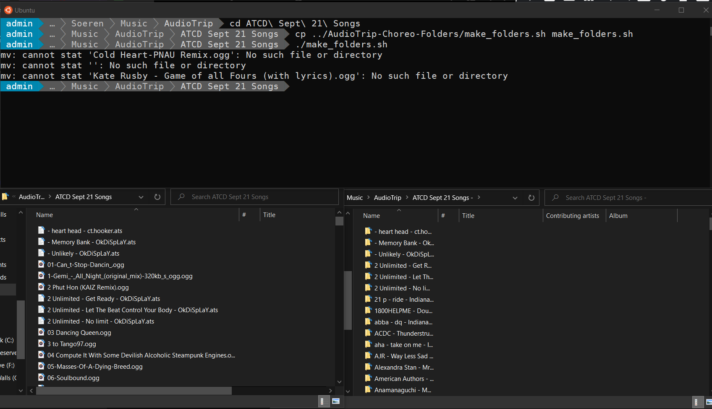

# AudioTrip-Choreo-Folders
Bash script to automatically create sub-folders for AudioTrip custom choreos

*script by Soeren Walls (@solarbabies)*

## How to make AudioTrip choreo sub-folders

1. Click the "**Get All**" link at the top of [this spreadsheet](https://docs.google.com/spreadsheets/d/e/2PACX-1vSkLrlwY9o4Rx0mfkhanArNRbuRvX5acyV_DuhFTo86p-dl-dgrZfqKSn6ob-S2HIC0AhiD-pi4ItbR/pubhtml?gid=0&single=true) to download all custom AudioTrip choreos from [ATCD](https://discord.gg/3vZP5YK)
2. Extract the `.zip` to a folder on your computer, e.g. `~/Desktop/ATCD Sept 21 Songs/`
3. Download `make_folders.sh` to the same folder you just created with all the `.ats` and `.ogg` files
4. Open unix terminal and run `./make_folders.sh` to move all songs into their own sub-folders for easier oranization and management

## Screenshot

## FAQ

1. *How do I run this bash script in a unix terminal on **Microsoft Windows 10**?*

    Unix terminal is available by default on MacOS and Linux. For Windows, you need to download the (free) [Ubuntu WSL](https://ubuntu.com/wsl) distro from the Windows Store, or follow the directions [here](https://docs.microsoft.com/en-us/windows/wsl/install).

2. In the console output, I see errors like `mv: cannot stat '...': No such file or directory` - wtf?

    This means the `.ats` JSON file for that song has a different `"songFilename"` value from the actual `.ogg` file name. This could be due to an error in the choreo file itself, or a simple human mistake (these files are manually archived by the wonderful `FawneDaBear#7043` (**@AmlRetroYet**) <3

    **You can safely ignore the error message** and transfer the songs to your headset as normal, or if you want to keep it clean, just manually move that song into the correct sub-folder (which should have already been created by running the above script).